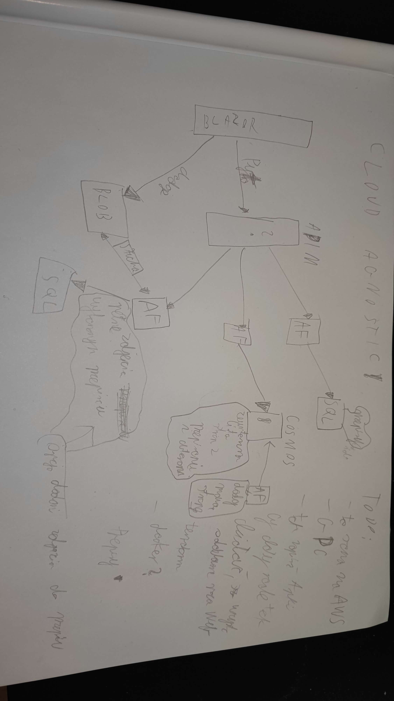
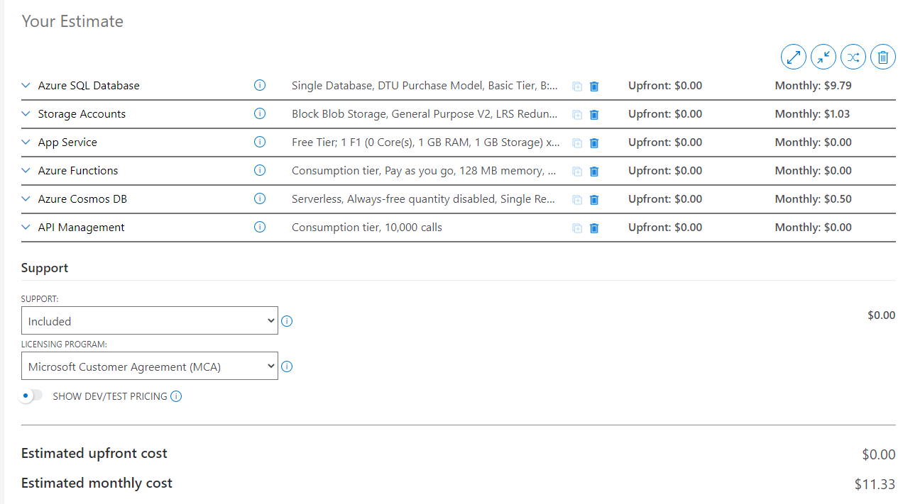

# recipes-cloud
Plan is to create application, which will have recipies, display the list of thme, have ability of adding new one, option to return external links with recipies from outside, adding reviews of recipies by users. On the beginning without any auth, later I'll decide what to do with it.

Deploy to:
- Azure
- AWS
- GCP
- Docker with gRPC
# Cost

